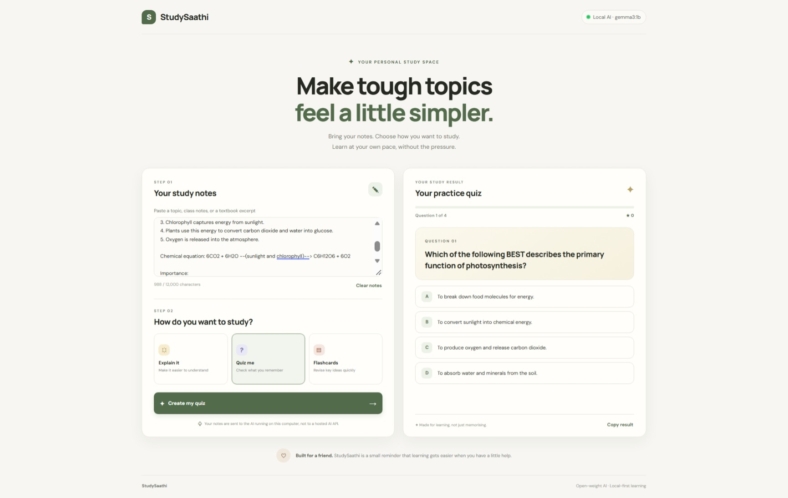
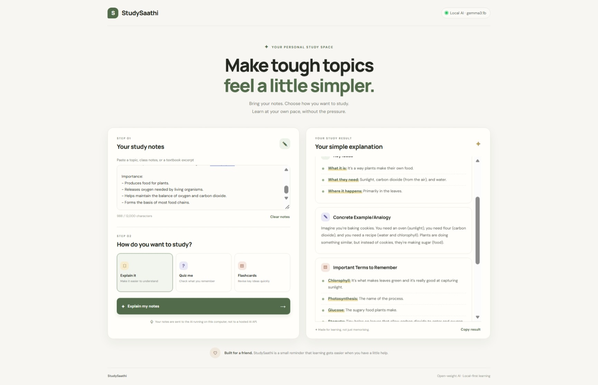
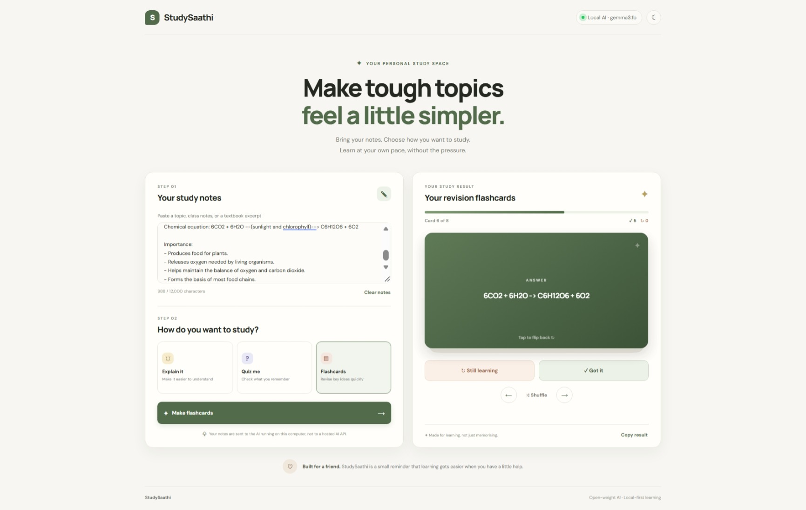

# StudySaathi 📚

**StudySaathi** is a local-first AI study buddy built with Flask, Ollama, and Gemma. Paste your class notes and choose how you want to study: get a simpler explanation, generate a practice quiz, or create revision flashcards.

It was built for the **Hacktoberfest Weekend Challenge: Build for a Friend** — the idea is to make studying feel a little less stressful and help a friend revise at their own pace.

## Demo

Screenshot of StudySaathi generating a practice quiz from Biology notes about photosynthesis:



Screenshot of StudySaathi generating a Explanation from Biology notes about photosynthesis:



Screenshot of StudySaathi generating a flashcard from Biology notes about photosynthesis:




## Features

- **Explain it:** turn notes into a beginner-friendly explanation.
- **Quiz me:** generate five multiple-choice questions, with answers and explanations.
- **Flashcards:** create quick revision cards from notes.
- Responsive interface for desktop and smaller screens.
- Local inference through Ollama and Gemma; the core study workflow does not use a hosted AI API.
- Notes are not saved to a database by this app.

## Tech stack

- **Frontend:** HTML, CSS, JavaScript
- **Backend:** Python and Flask
- **Local AI runtime:** Ollama
- **Model:** `gemma3:1b` by default

## Requirements

- Python 3.11 or newer
- [Ollama](https://ollama.com/download)
- Enough RAM for the selected model (performance varies by computer)

## Setup

### 1. Install and download the model

Install and start Ollama, then run:

```bash
ollama pull gemma3:1b
```

Confirm the model is available:

```bash
ollama list
```

### 2. Open the project folder and create a Python environment

**Windows PowerShell:**

```powershell
python -m venv .venv
.\.venv\Scripts\Activate.ps1
python -m pip install --upgrade pip
pip install -r requirements.txt
python app.py
```

If virtual-environment creation fails, delete the incomplete `.venv` folder and try again. If the issue continues, check which Python installation is being used with `python --version` and `python -c "import sys; print(sys.executable)"`.

**Windows Command Prompt:**

```bat
python -m venv .venv
.venv\Scripts\activate
python -m pip install --upgrade pip
pip install -r requirements.txt
python app.py
```

**macOS/Linux:**

```bash
python3 -m venv .venv
source .venv/bin/activate
python -m pip install --upgrade pip
pip install -r requirements.txt
```

### 3. Run StudySaathi

Make sure Ollama is running, then start the Flask app from the project folder:

```bash
python app.py
```

Open [http://127.0.0.1:5000](http://127.0.0.1:5000) in your browser.

## Configuration

By default, the app uses model `gemma3:1b` and Ollama at `http://localhost:11434`.

**Windows Command Prompt:**

```bat
set OLLAMA_MODEL=gemma3:1b
set OLLAMA_URL=http://localhost:11434
python app.py
```

**macOS/Linux:**

```bash
export OLLAMA_MODEL=gemma3:1b
export OLLAMA_URL=http://localhost:11434
python app.py
```

You can select another model that is already installed in Ollama by setting `OLLAMA_MODEL` to its exact local model name.

## Privacy and offline use

The core AI request goes from Flask to the Ollama service configured on your computer. The app does not store notes in a database or intentionally send them to a hosted AI API. Keep Ollama configured locally if you want local processing.

The page imports Google Fonts through CSS, so the font may be fetched online. After installing the dependencies and downloading the model, the core app can be used locally; for a strict offline setup, the custom font may fall back to system fonts. Do not expose Flask's development server to the public internet.

## Current status

- [x] The app launches in the local development environment.
- [x] Quiz generation has been manually tested; see the screenshot above.
- [ ] Test Explain and Flashcards and verify their output.
- [ ] Ask a friend to try the app and record their honest feedback.

## Limitations

- AI-generated content can be incorrect or incomplete. Verify important facts against course materials.
- The quiz is generated as text; it is not an automatically graded interactive quiz yet.
- Generation speed depends on your computer and the selected model.
- The Flask debug server is for local development, not production deployment.

## Model terms

Review and follow the applicable Gemma terms for the exact model you use: https://ai.google.dev/gemma/terms

## Future improvements

- Add automated tests and accessibility improvements.
- Add optional interactive quiz scoring.
- Collect real user feedback and improve the study flow.
- Choose and add a license for this project's code before publishing it as open source.
